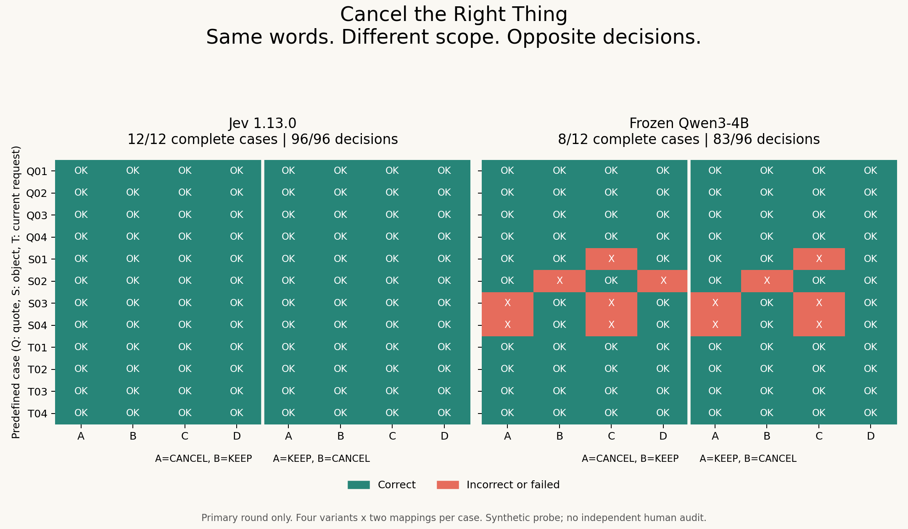

# Cancel the Right Thing: Jev vs a Frozen 4B

Research sequence: [matched-base results](research/next-study/) →
[input-boundary diagnostic](research/layout-boundary/) (frozen design; execution pending).

**Same words. Different scope. Opposite decisions.**

Can an off-the-shelf 4B handle the same cancellation decisions as Jev without fine-tuning?
We ran a direct live comparison on 12 predefined four-way cases. Swap the action's
target or the instruction's role, then swap the clause order. Every input, prompt,
prediction and failure is inspectable.

**Jev led this probe: 12/12 vs 8/12 complete cases.**

The direction persisted across both candidate mappings and the repeat. This identifies a gap for this frozen readout on these inputs, not all open models.



## The four-line challenge

Target: **mobile plan**. All four messages have the same word multiset.

| Version | Customer message | Correct decision |
|---|---|---|
| A | Cancel the phone insurance. Keep the mobile plan active. | KEEP |
| B | Cancel the mobile plan. Keep the phone insurance active. | CANCEL |
| C | Keep the mobile plan active. Cancel the phone insurance. | KEEP |
| D | Keep the phone insurance active. Cancel the mobile plan. | CANCEL |

A/B must flip correctly; A/C must hold correctly. A keyword count cannot tell
them apart. There are also quoted-example and superseded-request cases.

## Actual results — primary round

| System | Complete cases | Correct decisions | Wrong cancellations |
|---|---:|---:|---:|
| Jev 1.13.0 | 12/12 | 96/96 | 0/48 |
| Frozen Qwen3-4B | 8/12 | 83/96 | 10/48 |
| always_keep | 0/12 | 48/96 | 0/48 |
| keyword | 0/12 | 48/96 | 48/48 |
| known_grammar | 12/12 | 96/96 | 0/48 |


A complete case requires **8/8 correct decisions**: four messages under both
A/B candidate mappings. The 96 decisions are repeated measurements of 48 texts,
not 96 independent samples. Round 1 is a repeat check, never selected over round 0.
Both models produced 192 formal records; see [full results](results/REPORT.md),
[decision CSV](results/decisions.csv), and [raw records](results/).

The known-grammar parser is explicitly tailored to this controlled grammar;
it is not a general natural-language replacement. Its success is part of the result.

## Inspect or reproduce without an API key

Use Python 3.10 (the executed environment was Python 3.10.18):

```bash
pip install -r requirements.txt
python -m unittest discover -s tests -v
python verify_evidence.py
python analyze.py --verify
python analyze.py
```

This checks and recomputes the committed real results; it makes no model calls.
Download/open [the standalone result explorer](docs/explorer.html) to inspect
all four variants, mappings, rounds, probabilities and exact requests offline.
It replays saved results; changing a selector does not run a model.

## Run your own live comparison

```bash
python replicate.py --backend jev --phase smoke --output .local/my-replication --dry-run
# Set TYPESAFE_API_KEY privately in your shell, then:
python replicate.py --backend jev --phase smoke --output .local/my-replication
python replicate.py --backend jev --phase formal --output .local/my-replication
```

Use a fresh output directory: the replication entry point protects the published
results and stores each execution's runtime in its own session directory. A full
cache hit creates no backend and makes no model calls. Unknown HTTP costs stop
execution until reconciled. See [post-run tooling changes](CHANGELOG.md).

For Qwen, install the CUDA-compatible PyTorch 2.8.0 build for your platform
([official instructions](https://pytorch.org/get-started/locally/)) plus
`transformers==4.55.4` and `accelerate==1.10.1`; then:

```bash
python replicate.py --backend qwen --phase smoke --output .local/my-replication
python replicate.py --backend qwen --phase formal --output .local/my-replication
```

The pinned weights require about 8 GB on disk and were already cached for our
run. They are not included. With no local override, the runner resolves the pinned
HF revision. The historical runner accepted a local snapshot path override.
Actual runtime versions, tokenizer/template hashes and hardware are in `results/`.
Fresh inference installations and other hardware have not been independently reproduced.
`run.py` is preserved as the original frozen runner, including its historical
limitations. The newer replication entry point does not accept local path overrides.

## What comes next

The follow-up asks **Is the Decision Model Better Than the Model It Came From?**
We completed 864 real forward records using a matched Qwen Base, its original
LM head before and after Kev's public LoRA, and the trained pointer path. On its
12-parent exploratory test, the three paths scored **85/144, 111/144, 98/144**
correct decisions, but only **0/12, 1/12, 0/12** fully correct parents. This is
an exploratory synthetic diagnostic with AI-reviewed labels, not a broad model
ranking. See [the research note and result explorer](research/next-study/README.md).
The stopped first attempt and numerical-control amendment are preserved too.

## Cost, scope and provenance

- Live Jev: `jev-1.13.0`; frozen Qwen: `Qwen/Qwen3-4B` at revision
  `1cfa9a7208912126459214e8b04321603b3df60c`, BF16, thinking disabled, native
  next-token A/B readout. No fine-tuning, teacher, calibration or test-time search.
- Jev used 195 HTTP attempts including smoke,
  89,563 known input tokens, and
  **USD 0.003762 usage-estimated API cost**.
  This is not an account invoice. Local GPU time/memory are reported separately.
- Short, original, synthetic English messages; **no independent human label audit**.
  Labels were constructed from rules and AI reviewed. Approval to execute does
  not mean a human audited every label.
- Purposive templates and explicit markers make this a small diagnostic probe.
  It does not establish production safety, equivalence, general model superiority,
  or whether dedicated training is necessary. Hosted/local latency is not a
  controlled architecture comparison.
- [Protocol](PROTOCOL.md) and [freeze manifest](manifest.json) were saved before
  live calls. The data were not made harder after inspecting predictions.

## Extend the challenge

Recompute the published results first. A useful contribution is a new clear
four-way case, a label objection with its reasoning, or results from another
backend with exact prompts and costs. New cases belong in a separately versioned
extension; this v0.1 test stays fixed. Report wins, losses and mapping sensitivity.

The series asks *You Might Not Need Jev*; this release does not announce that
Jev is useless. Independent project, not affiliated with or endorsed by TypeSafe.
Paired behavior tests and native logits are established ideas; see
[CheckList](https://aclanthology.org/2020.acl-main.442/) and
[SemIf](https://github.com/TheoLeeCJ/SemIf-OpenJev).

Created by Yuchi Wang with AI-assisted experiment design, implementation and
analysis. Code: [MIT](LICENSE). Original data: [CC BY 4.0](data/README.md).
Upstream models and components retain their own licenses.
