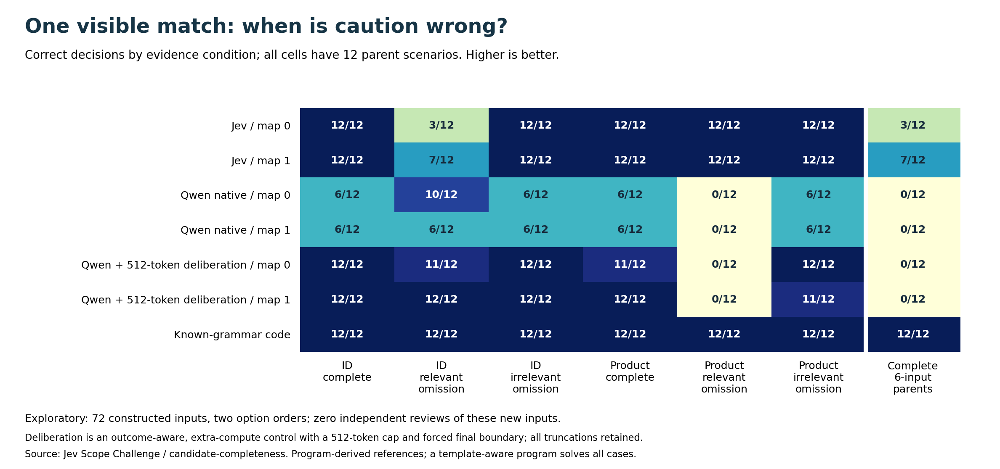

# Does a fixed reasoning budget change the native result?

**Completed outcome-aware exploratory control on the same 12 parents /72 inputs. New independent human review remains at zero.**

This arm uses the same Qwen3-4B instruction weights and user content as the no-thinking native arm. It allows up to 512 greedy deliberation tokens, closes the reasoning block if necessary, then reads A/B/C native logits once. It adds computation and changes the reasoning prefix/readout context; it is not a single-factor test of internal reasoning, natural free-form accuracy or an equal-budget comparison with Jev.

**Comparator qualification added after the run:** the [model card at the exact Qwen3-4B revision](https://huggingface.co/Qwen/Qwen3-4B/blob/1cfa9a7208912126459214e8b04321603b3df60c/README.md) advises sampling for thinking and explicitly warns against greedy decoding. Our 512-token greedy control is a budgeted configuration, not the vendor-recommended reasoning baseline. Making execution match the frozen protocol does not establish comparator strength. See the [readiness and fairness audit](../baseline-readiness/README.md). Results are unchanged; the recommendation does not prove that a different configuration would fix these errors.

The repaired control improves aggregate correctness from 34/72 to 58/72 in mapping 0 and from 30/72 to 59/72 in mapping 1. However, it still gives a determined answer on every one of the 12 unknown-reference inputs in each mapping. Better determined-case reasoning does not establish correct evidence-sufficiency behavior in this fixed configuration.

|Arm / mapping|Correct /72|Complete parents /12|False commitments /12 unknown|Unnecessary deferrals /60 determined|
|---|---:|---:|---:|---:|
|Jev / 0|63|3|0|9|
|Jev / 1|67|7|0|5|
|Qwen native, thinking off / 0|34|0|12|0|
|Qwen native, thinking off / 1|30|0|12|0|
|Qwen deliberation cap 512 / 0|58|0|12|0|
|Qwen deliberation cap 512 / 1|59|0|12|0|

Strict complete parents across both mappings: Jev 3/12, native Qwen 0/12, budgeted Qwen 0/12. A known-grammar program is 12/12 and 72/72. Repeated mappings do not increase the number of independent parent scenarios.

## Paired changes and all condition cells

|Mapping|Native errors corrected|Native correct answers regressed|Option-order note|
|---|---:|---:|---|
|0|25|1|Same 72 inputs; no selection|
|1|29|0|Same 72 inputs; no selection|

The budgeted arm changes semantic answer across mappings on 5/72 inputs. Its repaired smoke score is 4/6; smoke errors did not change the main grid.

|Request / coverage|Jev map 0 /12|Native map 0 /12|Budgeted map 0 /12|Budgeted map 1 /12|
|---|---:|---:|---:|---:|
|explicit / complete|12|6|12|12|
|explicit / relevant_omission|3|10|11|12|
|explicit / irrelevant_omission|12|6|12|12|
|product / complete|12|6|11|12|
|product / relevant_omission|12|0|0|0|
|product / irrelevant_omission|12|6|12|11|

## Truncation and probability audit

|Reasoning termination, main only|Recorded decisions|Reference matches|Unknown-reference matches / records|
|---|---:|---:|---:|
|think_end|75|63|0 / 12|
|budget|69|54|0 / 12|
|model_eos|0|0|0 / 0|

All main terminations remain in the 144 repeated-decision records. Differences between natural termination and truncation are descriptive and confounded by difficulty; they do not show that raising the cap would repair errors. No second budget was searched.

Final A/B/C full-vocabulary mass: minimum 0.006698, median 0.998286; 2/144 main records below 0.01. Candidate-normalized scores are not calibrated confidence.

## Exact work, including the stopped attempt

|Recorded work|Repaired greedy v2|Stopped sampled smoke|
|---|---:|---:|
|Decisions|150|6|
|Batches|38|2|
|Initial prompt tokens, unpadded|181,060|2,692|
|Generated nonpadding tokens|69,771|2,249|
|Final prefill tokens, unpadded|251,112|4,948|
|Physical model forwards|19,129|932|
|Processed token positions including padding|563,924|11,104|

Measured batch work totals 831.71s for v2, plus 29.39s for the stopped smoke. V2 peak allocated memory: 9535.1 MiB. Model loading is separately logged. This excludes publication, inspection and software checks. Token positions are a work-accounting measure, not FLOPs or billable hosted tokens.

The baseline native arm used 150 single-sequence prefills; this arm uses batched generation and a final prefill. Both are measured configurations, not a controlled throughput contest. All work used existing local weights; no paid API or model download was added by this control. Earlier Jev usage remains reported separately.

## Why there are two execution versions

The original reasoning freeze was published at `db2837c`. Its first six smoke jobs completed, but Transformers 4.55.4 overrode default-valued `do_sample=False` with checkpoint defaults. A CPU-only check reproduces the resulting sampling mode. No original main job ran. Those outputs are preserved under `results/reasoning_*` and are not pooled into the intended greedy comparison.

Repair freeze `4527534` preceded all v2 outputs. It keeps prompts, cases, order and cap byte-identical, passes `use_model_defaults=False, do_sample=False`, asserts the resolved mode before inference, and logs the effective configuration. Total control decisions are 156, including the six stopped sampled smoke jobs. This is a disclosed execution correction, not a choice of the better-scoring decoding mode.

## Stage decision and limits

The fixed native and reasoning arms are now closed. The outcome tells us how two concrete interfaces behave; it does not settle whether more reasoning, another ordinary model, a different prompt or dedicated training is necessary. Program-derived labels, supplied coverage truth, one template family and no new independent review constrain all results. A readable trace is not evidence of a faithful model mechanism.

Next: obtain new-material semantic review and narrow a transfer question before proposing an intervention. Stronger ordinary baselines and fair cost controls remain necessary for replacement claims. Avoid a third prompt/cap search on these inspected cases. The [post-result nearest-work screen](RELATED_WORK_POSTRUN.md) identifies prior over-abstention, evidence-boundary and agentic-stopping work; no new general method is claimed.

Reproduce without inference: `python research/candidate-completeness/reasoning_analyze.py --verify` and `python research/candidate-completeness/reasoning_report.py --verify`. Read [v1 protocol](REASONING_PROTOCOL.md), [v2 amendment](REASONING_GREEDY_V2.md), [CPU configuration audit](generation_config_audit.json), [raw v2 outputs](results/reasoning_greedy_responses.jsonl) and [summary](results/reasoning_summary.json).
