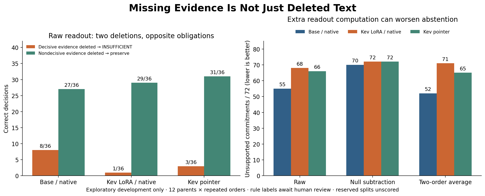

# Missing Evidence Is Not Just Deleted Text

Status: **development experiment completed; independent human review pending**.

Can a decision system distinguish deleting the fact that determines its answer
from deleting a fact that does not matter? Always abstaining cannot solve both.

New synthetic mechanisms: joint approvals, reversal exceptions, linked route
permissions, and a composed mechanism reserved for later test. Six views per
parent include decisive deletion, nondecisive deletion and conflicting records.
48 parents / 288 inputs; labels are rule-generated, not human-validated.

This release only permits **development inference**. Twelve calibration parents
and 24 test parents remain unscored pending independent labels/adjudication and
a new execution protocol. Public text is not secret or claimed globally unseen.

Read the [protocol](PROTOCOL.md), [corpus](data/cases.jsonl), [data card](data/README.md),
[truth solver audit](data/solver_audit.json), [source/novelty boundaries](related_work.md).
The model paths match the previous pinned Base/native, LoRA/native and pointer
diagnostics. Representation is fixed to original evidence/state + policy/question.
Raw output, null-subtraction ablation and two-order averaging are ordinary
baselines with explicit computation; no new algorithm is claimed.

**The pointer preserved answers after nondecisive deletion in 31/36 decisions,
but recognized decisive evidence deletion in only 3/36.** Both deletions were
answered correctly in just 1/36 paired units. This is a small development
diagnostic, not a Jev result or a validated model ranking.



|Path / raw readout|Correct / 216|Decisive deletion / 36|Nondecisive deletion / 36|Both deletions / 36|False commitments / 72|Complete parents / 12|
|---|---:|---:|---:|---:|---:|---:|
|Base / native (N0)|102|8|27|7|55|0|
|Kev LoRA / native (N1)|96|1|29|0|68|0|
|Kev pointer (K1)|106|3|31|1|66|0|

The 216 decisions per path are 72 texts under three option orders, generated
from 12 parents. False commitments count ALLOW/DENY on decisive deletion or
conflict (72 repeated decisions). Complete parents require all 18 decisions.
Do not treat these denominators as independent samples or infer significance.

Null subtraction raised N1 total correctness from 96 to 111/216 while raising
false commitments from 68 to 72/72. All three null-subtraction paths scored
0/12 complete parents and at most 1/36 deletion pairs. A total-score gain can
hide a worse decision policy. The meaningful no-evidence reference is not
content-free calibration; the readout can suppress justified abstention.
Two-order averaging is also reported, including regressions and extra compute.

Inspect [the saved-result explorer](docs/explorer.html),
[all nine readouts](results/REPORT.md), [every family/view count](results/ALL_COUNTS.md),
[raw main/null records](results/), and [the research note](NOTE.md).
The [blank review page](review/review.html) and [review instructions](review/README.md)
are ready for later independent annotation. Download the HTML to use it offline;
GitHub's file viewer displays source rather than serving the application.

The scientific source, corpus, encoded inputs and protocol were published at
[`4809a5b`](https://github.com/Yuchi-Wang02/jev-scope-challenge/commit/4809a5b2ea9aa8aef803f2875ad064998f60dd0b)
before inference. Result analysis, verification helpers and UI preparation do
not change that frozen configuration. No reserved model record exists.

## Reproduce committed evidence without a model

Python 3.10, with root `requirements.txt`:

```bash
python -m unittest discover -s tests -v
python research/evidence-gap/verify_gap.py
python research/evidence-gap/review_tools.py verify
python research/evidence-gap/release_tools.py --verify
```

These checks are read-only and make no model/API call. To additionally re-encode
all 1,008 main/null input plans with the existing pinned tokenizer cache:

```bash
python research/evidence-gap/verify_gap.py --cache path/to/hf-cache
```

This optional check requires the historical Transformers/Torch environment and
does not download weights or score reserved inputs. The historical runner
refuses to overwrite existing outputs. It has no reserved scoring CLI switch.

The actual run used an RTX 5070 Ti, 81.53 seconds end to end (including loading,
audits and parity), peak allocated memory 7,987 MiB. This is one local execution,
not a throughput benchmark or endpoint latency comparison. Scientific forwards:
648 main + 108 shared null = 756; 252 extra parity checks and six warmups.
1,944 readout predictions reuse those records. No training, Jev API, new weight
download or paid cloud job was used.
