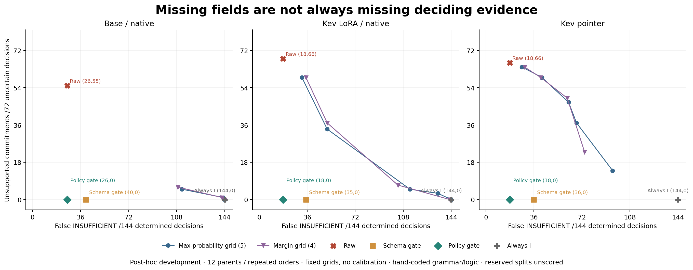

# Can a guard tell missing evidence from missing fields?

Status: **post-hoc development follow-up completed**. Prior model scores were
already known before this design. No confirmation or new algorithm claim.

We compare fixed score cutoffs, naive schema completeness, policy-aware
determinacy and a full known-grammar solver. The question is whether reducing
unsupported commitments necessarily causes false abstention when missing facts
do not matter. The policy-aware guard contains a strong external program prior;
it must be reported beside pure code, not advertised as model-only improvement.

Read [the fixed protocol](PROTOCOL.md). All methods reuse 648 real development
main records. No new model call, calibration fit, reserved score, training,
paid API call or model download. Independent human annotations remain zero.

**The guard worked because it knew the policy.** Applied to the Kev pointer,
the policy gate removes all 66 unsupported commitments, with zero new false
INSUFFICIENT responses. But 26 wrong determined actions remain, and only 2/12
parents pass all views/orders. The full known-grammar code reference is 216/216.
Once the policy is explicitly encoded, code is a necessary comparison.

|Path|Method|Correct /216|Deletion pair /36|Unsupported /72|False INSUFFICIENT /144|Wrong determined actions /144|Complete /12|
|---|---|---:|---:|---:|---:|---:|---:|
|Base/native|raw|102|7|55|26|33|0|
|Base/native|schema gate|143|13|0|40|33|0|
|Base/native|policy gate|157|27|0|26|33|0|
|Kev LoRA/native|raw|96|0|68|18|34|0|
|Kev LoRA/native|schema gate|147|12|0|35|34|0|
|Kev LoRA/native|policy gate|164|29|0|18|34|0|
|Kev pointer|raw|106|1|66|18|26|0|
|Kev pointer|schema gate|154|13|0|36|26|1|
|Kev pointer|policy gate|172|31|0|18|26|2|
|Known grammar + full solver|pure code|216|36|0|0|0|12|

216 decisions = 72 texts under three option orders, from 12 parents.
The 72 uncertain decisions are decisive deletion/conflict; the 144 determined
decisions are the four remaining views. Complete parents require all 18 decisions.
No significance, held-out transfer or model ranking is inferred.



The fixed maximum-probability 0.99 point still leaves 14/72 unsupported pointer
commitments and unnecessarily refuses 95/144 determined decisions. It has
20 wrong actions among 63 actions (risk 20/63), despite retaining only actions
whose maximum candidate score is at least 0.99. This point is an illustration
from the prelisted grid, not a selected/calibrated operating threshold. All
five max-probability and four margin points are published for every model path.

Inspect [every path/family/view count](results/ALL_COUNTS.md),
[all derived decisions](results/predictions.jsonl), [per-text gate certificates](results/gates.jsonl),
[the saved-result explorer](docs/explorer.html), and [interpretation/next steps](NOTE.md).
Download the HTML to replay it locally; GitHub's file viewer shows the source.
The [blank human-review material](../evidence-gap/review/) remains unchanged.

## What computation and knowledge were added

The same parser derives target facts and schema from the visible text/policy,
never the gold or construction records. Schema and policy gates share that
parse across model paths/orders. The policy gate contains hand-coded knowledge
of approvals, exceptions and route permissions; it is a partial rule engine,
not general learned extraction. It only suppresses an action, retaining wrong
ALLOW/DENY when the rule is determined. It never forces raw INSUFFICIENT into
an action. That is why false INSUFFICIENT stays unchanged while errors remain.

The program predicate agrees with finite-world determinacy on 96 partial/conflict
states of the three development policies. Unsupported grammar and the reserved
composed policy raise an error. This proves finite code logic, not independent
human meaning or robustness to arbitrary paraphrases. Every path gets the same
helper; the stronger code prior is disclosed rather than credited to the model.

Source and methods were published at
[`48e8d95`](https://github.com/Yuchi-Wang02/jev-scope-challenge/commit/48e8d95d9632c1858017af6e251fd9ca98edad6d)
before this derived run. The design is still post-hoc because original development
scores were already known. Configuration hash and all old scores are frozen.
8,424 new method rows and 216 deterministic code rows are derived, not model
forwards or independent data. No GPU/API was used. Model-dependent pipelines
nominally still require the prior single forward plus parsing/gate work; reuse
does not make future model cost zero. The CPU run took 0.47 seconds including
verification/derivation/output; this is not a latency comparison.

## Verify without inference

Use Python 3.10 and root requirements:

```bash
python -m unittest discover -s tests -v
python research/evidence-guards/verify_guards.py
python research/evidence-guards/publish_guards.py --verify
```

Verification is read-only. The historical `guard_study.py run` refuses to
overwrite existing results. The previous scientific study remains intact;
reserved calibration/test remain unscored and human annotations remain zero.
