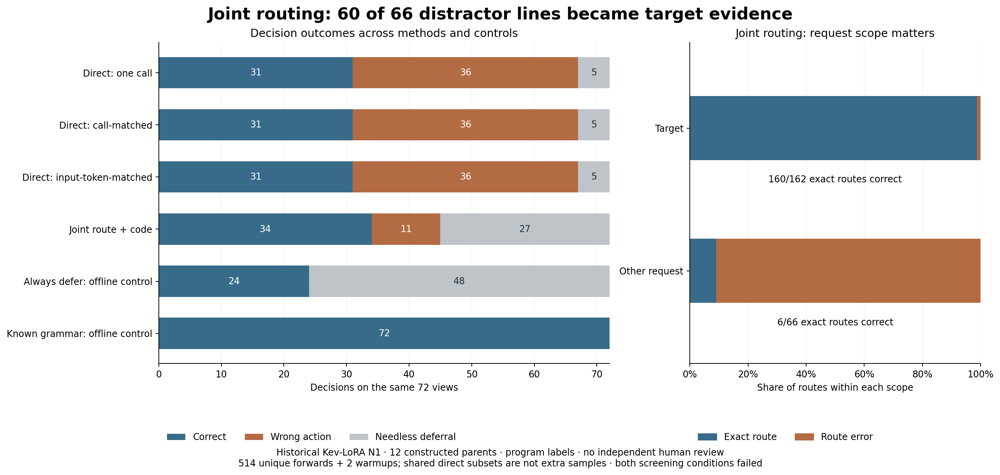

# Joint routing results and request scope errors

**The frozen joint-routing candidate failed both parts of its development screen.**
It reached 34/72 correct decisions, 11/24 false commitments and 21/48 correct
determined decisions. The fixed direct controls each reached 31/72. Joint routing
correctly labeled 160/162 target-request lines, but turned 60/66 other-request
lines into target-field evidence. These are the same 72 public synthetic
development views in 12 parent groups, with program-derived labels and zero
independent human annotations. This is not a new Jev measurement.



## Every fixed method and the offline controls

|Path|Correct /72|False commitments /24|Determined correct /48|Needless deferrals /48|Wrong determined actions /48|Complete parents /12|Calls|Input tokens|Summed forward seconds|
|---|---:|---:|---:|---:|---:|---:|---:|---:|---:|
|Direct: one call|31|23|30|5|13|0|72|23523|6.81|
|Direct: call-matched|31|23|30|5|13|0|228|76855|22.13|
|Direct: input-token-matched|31|23|30|5|13|0|286|95849|27.74|
|Joint route + code|34|11|21|27|0|1|228|95889|25.93|
|Always defer: offline control|24|0|0|48|0|0|0|0|Not measured|
|Known grammar: offline control|72|0|48|0|0|12|0|0|Not measured|

The two offline controls are recomputed from visible state and policy, then graded;
they are not new model forwards or empirical extraction improvements. The parser
knows the declared grammar. Zero model calls does not mean measured zero CPU time.

Call-matched direct uses 228 calls but 19,034 fewer input tokens than joint.
Input-token-matched direct uses 95,849 tokens, 40 fewer than joint, but 58 more calls.
The direct single/call/token rows reuse one 286-query union; do not sum their
deployment call counts to infer experiment size. Actual execution was 228 + 286
= **514 unique scientific forwards**, 191,738 input tokens and two warmups.
The two matched direct methods have identical predictions on all 72 views.
Their 31/72 totals match the single-call total, but the single-call predictions
differ on three views: one correction, one regression and one wrong-to-wrong
action change. Equal totals do not mean every prediction is unchanged.

## The gate failed and the error source remains

The published screen required at most 7/24 false commitments **and** at least
34/48 correct determined decisions. Joint produced 11 and 21 respectively.
Its unchanged form should not advance to confirmation. Correct field statuses
were 130/168; exact fact vectors were 34/72. It asserted values for 11/18 truly
missing fields. Fourteen TRUE and thirteen FALSE fields became CONFLICT;
all twelve reference CONFLICT fields were retained.

|Reference request scope|Lines|Exact route correct|Observed routing errors|
|---|---:|---:|---|
|Target request|162|160|2 wrong-field labels|
|Other request|66|6|60 labels that filled a target field|

The 60 wrong-request and two wrong-field labels account for all 62 routing
errors. These are correlated line judgments, not 228 independent examples.
The output pattern identifies a scope error; it does not reveal an internal
model mechanism or establish that more training is necessary.

For `joint_approval-1-full`, both target reviewers approve. A different
request has a reviewer B rejection. The model labeled that distractor
`review_b:NEGATIVE`, creating a target B CONFLICT and changing the final
action from the program-reference ALLOW to INSUFFICIENT. This trace uses
the saved selected label and unchanged executor, not a simulated model repair.

## Paired comparison at the parent unit

Against call-matched direct, joint corrected 20 wrong views but regressed
17 correct views; 14 stayed correct and 21 stayed wrong. Joint had more
correct views in four parent groups, fewer in four and tied in four.
These descriptive counts do not establish statistical significance or
population generalization on a constructed, inspected development corpus.

|Parent|Views|Call-matched direct correct|Joint correct|
|---|---:|---:|---:|
|joint_approval-1|6|4|3|
|joint_approval-2|6|2|2|
|joint_approval-3|6|3|3|
|joint_approval-4|6|2|6|
|reversal_exception-1|6|3|3|
|reversal_exception-2|6|1|3|
|reversal_exception-3|6|2|3|
|reversal_exception-4|6|2|3|
|route_lookup-1|6|3|2|
|route_lookup-2|6|2|2|
|route_lookup-3|6|4|2|
|route_lookup-4|6|3|2|

## Runtime and historical anchor

Execution commit: [`2df85df6c1bd0484025e73332f95cdddd22755aa`](https://github.com/Yuchi-Wang02/jev-scope-challenge/commit/2df85df6c1bd0484025e73332f95cdddd22755aa).
UTC start: `2026-09-30T02:07:34Z`. Recorded run duration: 62.86 seconds;
peak allocated GPU memory: 8108.65 MiB on an RTX 5070 Ti.
Run duration includes loading and audits; summed table latency measures individual
scientific forwards, not a deployment benchmark. The stack was Python 3.10.18,
torch 2.8.0+cu128, Transformers 4.55.4 and PEFT 0.17.1, BF16/math-only SDPA.
Cached weight hashes and all 504 adapter tensors matched the pinned artifacts.
The existing PEFT warning about newer optional adapter-config fields reappeared;
the exact loaded-tensor checks still passed. No package upgrade was performed.

All 72 single-direct prompts, token arrays, candidate arrays and option orders
matched the earlier N1 run. Predictions, logits and conditional candidate
probabilities reproduced exactly, with maximum absolute deltas of zero.
This is a local repeat check, not independent inference replication.

No new training, model download, paid API, cloud job, Jev call, rewrite score
or reserved score occurred. This uses the historical upstream Kev LoRA;
no new training does not mean an untrained adapter.

## Inspect or reproduce offline

[Open the complete saved-query viewer online](https://yuchi-wang02.github.io/jev-scope-challenge/joint_route.html)
or download [the identical standalone copy](docs/joint_explorer.html). It contains
all 72 texts, 228 route decisions, 286 direct judgments and the exact prompts.
Candidate distributions are conditional over the listed answer slots, not
calibrated correctness probabilities; route and direct spaces have different widths.

Raw evidence: [forwards](joint_results/v0.1/N1.jsonl),
[decisions](joint_results/v0.1/decisions.jsonl),
[field claims](joint_results/v0.1/fact_claims.jsonl),
[line audits](joint_results/v0.1/line_audits.jsonl),
[summary](joint_results/v0.1/summary.json) and
[runtime](joint_results/v0.1/runtime.json). Use full Git history for source checks.

```bash
python research/fact-execution/joint_execution.py verify-freeze
python research/fact-execution/joint_analyze.py --verify
python research/fact-execution/publish_joint.py --verify
```

The pre-inference [execution protocol](JOINT_EXECUTION_PROTOCOL.md) and its source
hashes stay unchanged. This report and viewer were created after the run.
The separate [multi-fact line stress](MULTIFACT_LINE_STRESS.md) remains software-only;
this run scored no packed line, so it does not address that interface limit.
Further scope tests or nonexclusive extraction need a new frozen protocol and
independently reviewed language variation. See [upstream credits](../../THIRD_PARTY_NOTICES.md).
