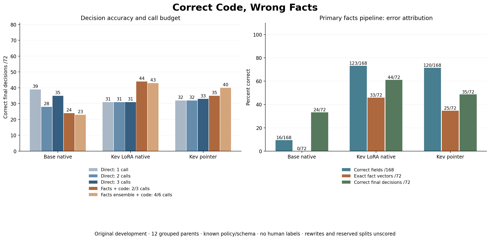

# Correct Code, Wrong Facts

Uses [Jared Palmer's historical Kev implementation and checkpoint](../../THIRD_PARTY_NOTICES.md)
and Qwen's pretrained base. No pointer-architecture novelty, new training or
current-release evaluation is claimed. This study's original-data license and
provenance are described in [the data card](data/README.md).

**Does the model need to decide, or only extract facts?** We ran 1,656 real cached
model forwards with schema-matched direct controls and a verified finite-policy
executor. The primary Kev-LoRA/native facts pipeline improved decisions from
31/72 to 44/72, but filled 14/18 missing target fields with an asserted value.
Code execution passed all 96 declared fact-state combinations; extraction
remained unreliable. These are original-development results, with zero
independent annotations and no scored rewrites or reserved inputs.



Read [the results and limitations](RESULTS.md), [all fixed method/family/view
counts](results/ALL_COUNTS.md), [frozen protocol](PROTOCOL.md), and
[fact contract](interface_schema.json). The four contract keys `field`, `status`,
`evidence_spans`, `provenance` are the interface payload; rows in fact_claims.jsonl
also carry separate evaluation/audit metadata, which is not part of that payload.

Open/download [the offline replay](docs/explorer.html) to inspect each decision,
fact vector and reference. [144 AI-generated rewrite pairs](review/README.md)
are ready for semantic review and have no model scores. Models produced no
evidence quotes: their citation field is null, distinct from construction labels.

The [cited-fact follow-up](CITED_FACT_PLAN.md) now includes a known-grammar
program-control implementation and adversarial software checks; its model
comparison remains a design, not a tested remedy.
The review pack now includes a read-only CSV validator; it never automatically
turns a complete export into independently verified labels.

## Reproduce the published evidence offline

```bash
python research/fact-execution/data_tools.py verify
python research/fact-execution/fact_run.py build
python research/fact-execution/fact_analyze.py --verify
python research/fact-execution/publish_facts.py --verify
python -m unittest discover -s tests -v
```

With the committed manifest, `build` verifies the existing freeze and makes no
tokenizer download or inference. The source is published before scoring; this
is still a post-hoc development diagnostic, because previous results on these
same original texts were known. Source freeze: `548e00f3e7322e2791541642f4371d60cec55ce1`.
The scientific runner refuses existing outputs; a new scored study needs a
separately versioned output/freeze rather than overwriting this run.
