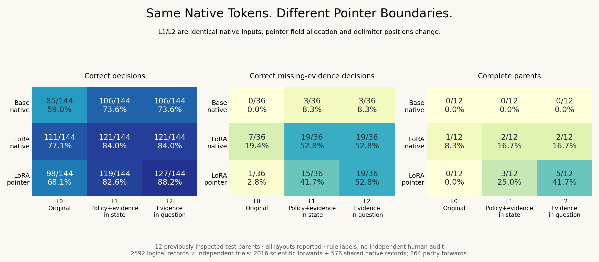

# Same Native Tokens. Different Pointer Boundaries.

**Completed: 2016 real scientific forwards, 576 explicitly shared native
records, and 864 additional pointer-path parity checks.** This follow-up uses
previously inspected synthetic inputs from [the matched-base pilot](../next-study/).

**Same weights. Different winner — on the old test panel.** Pointer accuracy
changes from 98/144 to 127/144 under the declared layouts; LoRA/native changes
from 111/144 to 121/144. Across all 24 pilot parents, L2 is only 244/288 versus
243/288, and the pointer trails on development and calibration. This is a
layout-sensitive diagnostic, not a broad pointer win or a selected serving fix.

|Path|Layout|Old test correct / 144|All pilot correct / 288|Old test complete / 12|Old test missing correct / 36|
|---|---|---:|---:|---:|---:|
|Base/native|L0|85|166|0|0|
|Base/native|L1|106|211|0|3|
|Base/native|L2|106|211|0|3|
|LoRA/native|L0|111|222|1|7|
|LoRA/native|L1|121|243|2|19|
|LoRA/native|L2|121|243|2|19|
|LoRA/pointer|L0|98|202|0|1|
|LoRA/pointer|L1|119|233|3|15|
|LoRA/pointer|L2|127|244|5|19|




L1 → L2 changes 21/288 pointer decisions over 12 inputs / 9 parents: 16
corrections, **5 regressions**. The identical native control is shared rather
than rerun. All 864 original-layout regression anchors and all 864 pointer
packed-versus-causal checks pass with probability delta **0.0**.

Read the [research note](RESEARCH_NOTE.md), [raw evidence](results/),
[grouped report](results/REPORT.md), [all metrics](results/summary.json),
or download/open the [saved-record replay](explorer.html). Every split and layout
is reported. The replay makes no model calls.

What changes when the same evidence is placed in a decision model's `state`
versus its `question` field? Two controls yield byte-identical prompts/tokens for
the ordinary LM readout, but different inputs for Kev's historical pointer path.
The original layout is rerun as a regression anchor. This targets input allocation,
not an isolated proof about head capacity or training necessity.

Read the frozen [protocol](PROTOCOL.md), [manifest](manifest.json),
[tokenizer-only preflight](preflight.json) and [encoded input plans](data/inputs.jsonl).
No new labels, teacher facts, training, API calls or weight downloads.

## Layouts

|Layout|State|Question instruction|
|---|---|---|
|L0|Original evidence|Original policy|
|L1|Policy + evidence|Fixed generic query|
|L2|Policy|Evidence + fixed generic query|

L1/L2 have identical native serialization. In the pointer path, the state/question
delimiter moves and whitespace tokenization can change. The alternative field
assignments may be outside training distribution. Report all layouts and their
effects on supported decisions as well as missing-evidence abstention.

## Run and inspect

Use the preceding pilot's Python 3.10 / CUDA / package environment and pinned
cached weights. No network fetch is needed. Install its requirements separately
if creating a new environment; local GPU execution is not part of CI.

```bash
python research/layout-boundary/layout_study.py build --cache /your/cache
python research/layout-boundary/layout_study.py run --cache /your/cache
python research/layout-boundary/layout_analyze.py
python research/layout-boundary/audit_inputs.py --cache /your/cache
python research/layout-boundary/verify_layout.py
```

A new replication needs an empty results folder in a separate checkout. Existing
partial or complete output is rejected. 2592 logical records correspond to 2016
scientific forwards and 576 explicitly shared identical native records; 864
additional standard-causal forwards check all pointer inputs. Original anchors
and parity gates stop at probability delta >= 1e-4 or changed predictions.

## Attribution and limits

Uses the pinned upstream [Kev historical encoder and pointer head](https://github.com/jaredpalmer/kev/blob/29d71c78368657b3a522729a01c748ea15272abc/kev/model.py)
via the unchanged Apache-2.0 source in the previous study. Its [native/adapted
probe](https://github.com/jaredpalmer/kev/blob/0c142becde423a0c68ec857f7831dac0315588a1/scripts/base_mmlu_probe.py)
motivates the three paths. No new architecture, calibration theory or general
benchmark novelty is claimed. Independent review and fresh confirmation remain
future requirements. Original synthetic data retain CC BY 4.0.

The [blind review sheet](review/README.md) has 96 blank inputs and **zero** human
annotations. The next gate is independent labels and a fresh source/mechanism
holdout with a fixed layout; the inspected pilot becomes development/regression.
Head-only versus joint training still has not run. Check [status](STATUS.md).
