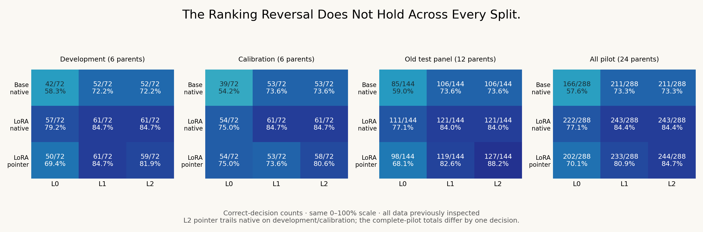

# Same Weights, Different Winner — Within an Exposed Pilot

## Finding

The preceding matched-base diagnostic put the adapted native path above the
historical Kev pointer path on 12 synthetic test parents. Its open question was
whether that ordering survived equivalent representation controls. It did not:
under the original layout, N1 correctly decided 111/144 versus K1's 98/144;
under the declared L2 allocation, N1 scored 121/144 versus K1's 127/144.

This is not a broadly superior pointer system. On all 24 inspected pilot parents,
the L2 totals are 243/288 native versus 244/288 pointer; the pointer trails on
development (59/72 versus 61/72) and calibration (58/72 versus 61/72). Whole
parent completeness is 5/24 for both paths under L2. The split-dependent result
shows why one convenient panel should not determine a model narrative.

## Controlled boundary pair

E is the complete original evidence text, P its complete original policy, and
G a fixed generic selection query. L0 retains state=E / instruction=P. L1 puts
P plus E into state with G in instruction. L2 puts P in state with E plus G in
instruction. Candidate descriptions and orders are unchanged.

The ordinary native serializer concatenates state, two newlines, instruction,
options, and Answer. Consequently L1 and L2 produce **identical native bytes,
token IDs and candidate slots**. Their native result is explicitly shared, not
represented as an independent repeat. Kev's historical encoder moves the
state/question delimiter and changes whitespace tokenization/field allocation.
It uses the same adapted backbone and trained pointer weights for all layouts.

The primary L1/L2 contrast changes 21/288 K1 decisions over 12 inputs / 9
parents, with 16 corrections and 5 regressions. On the old test panel alone it
changes 8/144 decisions over 4 inputs / 3 parents: 8 corrections, 0 regressions.
The five regressions occur on development/calibration. This is evidence of
boundary sensitivity within this contract stress test, not a universally helpful
field transformation. Unusual allocations may be outside training distribution.

L0 versus L1/L2 also relocates policy and introduces G, so that comparison does
not isolate one delimiter or one abstract head mechanism. Native N0 improves
from 166/288 to 211/288 across the pilot; N1 from 222/288 to 243/288, demonstrating
that ordinary serialization/prompt effects contribute as well.

## Evidence sufficiency and costs

On the old test panel, K1's L2 answers all 108 full/hold/flip decisions correctly,
but only 19/36 missing-evidence decisions. N1 L2 also gets 19/36 missing decisions;
its supported-view total is 102/108. Across all splits, native correctly handles
39/72 missing decisions versus pointer's 34/72. Improved headline accuracy does
not establish reliable abstention or a universal advantage.

No new training or paid API call occurred. Existing exact revisions of
Qwen3-4B-Base and the historical public Kev adapter/head were used. The executed
stack was Python 3.10.18, torch 2.8.0+cu128, transformers 4.55.4 and peft 0.17.1;
backbone BF16, pointer head FP32, unmerged LoRA, math-only SDPA, no TF32 or
quantization. This is neither a current-default Kev benchmark nor reproduction
of upstream FP32 numbers. No Jev or Laya score was collected here.

2592 logical rows represent 2016 scientific forwards plus 576 shared identical
native rows. Another 864 causal-backbone forwards check every pointer encoding,
and six warmups are separately recorded. Execution took about 216 seconds,
including cached-weight checksum verification and loading, and peaked at about
7987 MiB of PyTorch allocated GPU memory. Local computation and engineering have
cost; no new download or cloud/API fee was incurred. This is not a controlled
deployment latency comparison.

## Verification and provenance

The protocol/code/encoded plans were publicly frozen at `124ffa6` before
scientific inference. Design occurred after seeing the earlier pilot's outputs;
this is an exploratory follow-up on exposed data, not preregistered confirmation.
All 864 original-layout reruns match preceding probabilities exactly. All 864
packed-mask versus standard-causal pointer checks have maximum probability delta
0.0. These gates cover these inputs/environment, not arbitrary serving workloads.

All encoded plans were rechecked with the pinned tokenizer after inference;
all 2592 saved input sequences match, without truncation. Cached weight digests
match the preceding fixed objects, and all 504 expected LoRA tensors match loaded
parameters exactly. Read-only checks recompute the previous calibration summary
before accepting its transferred temperatures, verify logical/physical accounting,
and reject duplicated grids, altered sharing, and corrupted parity evidence.
No layout-specific temperature was refitted on the exposed test panel.

The unchanged historical [Kev encoder/pointer implementation](https://github.com/jaredpalmer/kev/blob/29d71c78368657b3a522729a01c748ea15272abc/kev/model.py)
is attributed under Apache-2.0. Kev's existing native/adapted probes motivated
the original paths. This adds a bounded allocation diagnostic and reproducible
records; it does not invent pointer classification or prompt controls.

## What this changes in the research plan

The old ordering is insufficient evidence for a head-capacity problem. We should
freeze a reasonable representation before testing head-only versus body adaptation,
and retain layout stress tests as separate robustness measures. The existing
24 parents are now development/regression inputs, with AI-checked rule labels
and no independent human annotation. A blank blind-review sheet has been prepared,
not completed.

The next study needs independent label adjudication, fresh source documents or
relation mechanisms, a preselected serialization and untouched grouped test.
It should compare baseline formatting against any proposed readout method under
matched evidence and computation, rather than letting prompt search masquerade
as algorithm novelty. Only a remaining, reproducible mechanism gap justifies
head-only versus joint-training experiments. No new learned checkpoint or paper
novelty claim is established by this release.
