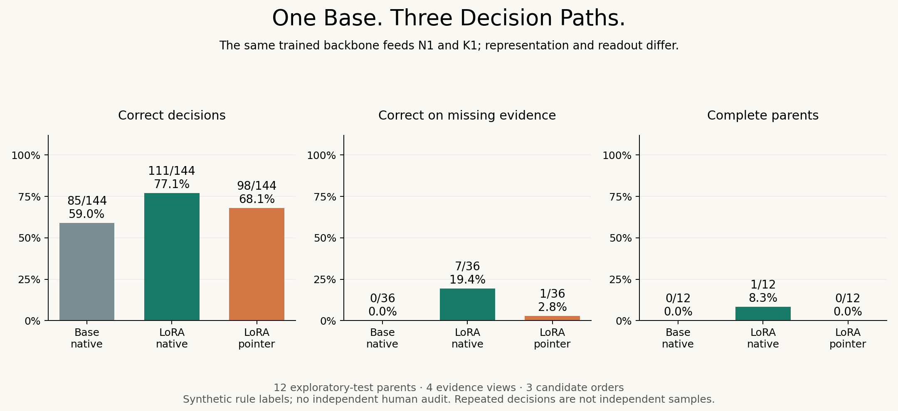

# Is the Decision Model Better Than the Model It Came From?

Follow-up: the [completed input-boundary diagnostic](../layout-boundary/) exactly
reproduces this original layout, then shows that the old test-panel ordering
reverses under declared representation changes. Across the entire pilot the new
paths are nearly tied. Read both studies before attributing a gap to the head.

An exploratory follow-up to the cancellation probe. Compare a pinned Qwen3-4B
**Base** checkpoint through its original LM head before and after Kev's public
LoRA, then evaluate Kev's complete pointer path. The earlier instruct-model
result is a regression reference, not this study's unchanged parent.

**Completed: 864 real scientific forward records in v0.2.** The LoRA improved
the native path on this pilot, while the pointer path retained less of that
decision-level gain. Missing-evidence decisions remain weak for all three paths.

|Exploratory test|Correct decisions|Complete parents|Correct missing-evidence decisions|
|---|---:|---:|---:|
|N0: unchanged Base, native LM head|85/144|0/12|0/36|
|N1: public LoRA, native LM head|111/144|1/12|7/36|
|K1: same adapted backbone, pointer path|98/144|0/12|1/36|



Read the [research note](RESEARCH_NOTE.md), [all split metrics](results/summary.json),
[decision CSV](results/decisions.csv), [raw records](results/), or download/open
the [standalone result explorer](explorer.html). This page replays saved results.
See [execution status](STATUS.md) and the [detailed plan](PLAN.zh-CN.md).

The baseline design is informed by Kev's existing native/adapted probes. Labels
are original rule-generated facts with AI-checked text, **not independently
human reviewed**. Twelve test parents define the groups; candidate mappings are
repeated measurements. K1 also changes representation, so this is no isolated
proof that a decision head caused the difference.

Phase 1 has no new training. Later head-only training depends on this diagnosis
and requires its own data, controls and execution record.

A [known-grammar text parser](code_reference.py) also reads the same rendered
state and gets 48/48 exploratory-test inputs / 12/12 parents correct. It was
implemented **after** seeing model outcomes and knows the complete construction
grammar; it is a post-run engineering reference, not a general language baseline
or new algorithm. See its [saved records and counts](results/C0_text_summary.json).

## Execute

The tested local stack starts with Python 3.10.18, torch 2.8.0+cu128,
transformers 4.55.4 and peft 0.17.1. Historical Kev model code is vendored with
its Apache-2.0 license and exact provenance hash; today's full Kev package is
not installed. Install a CUDA-compatible torch build appropriate to your device.

```bash
python research/next-study/study.py build
# Download only these exact revisions into your private model cache:
hf download Qwen/Qwen3-4B-Base --revision 906bfd4b4dc7f14ee4320094d8b41684abff8539 --cache-dir /your/cache
hf download jaredpalmer/kev-4b --revision c4bfa11b0dc07691884f2d97f1c4c4c05c92e416 --cache-dir /your/cache
python research/next-study/study.py run --cache /your/cache
python research/next-study/analyze_study.py
python research/next-study/verify_study.py
```

Model weights (about 8.2 GB total) stay outside Git. For a new replication, use a
separate checkout and an empty study `results/` folder. The runner rejects existing
scientific records rather than selecting a successful rerun. Full execution,
probability metrics and limits belong in the saved report, not guessed scores.

The exact additional package versions used were huggingface-hub 0.36.2 and
numpy 2.1.2. [Runtime](results/runtime.json) and [weight checksums](results/weight_checksums.json)
record the actual path. The stopped default-kernel attempt is in [attempts/v0.1](attempts/v0.1/TERMINATION.md).

The summary field `missing_false_acceptance` counts **any non-INSUFFICIENT
decision on a missing-evidence input**, including DENY. It means a false
commitment, not only a mistaken ALLOW. Calibration/risk figures use the separately
fitted temperature and fixed threshold; small observed zero risk is not a guarantee.

See [claims](claims.md), [related work](related_work.md), [novelty boundaries](novelty_matrix.md)
and [open questions](open_questions.md). Original data are CC BY 4.0; vendored
Kev source is Apache-2.0. Repository MIT does not replace upstream licenses.
