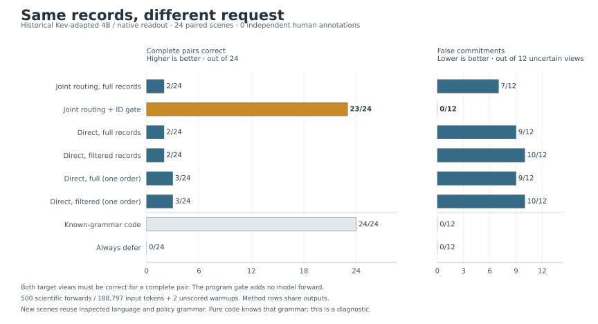

# Right facts, wrong request: a visible-ID gate changes the outcome

**The frozen directional diagnostic passed: complete target-switch pairs rose
from 2/24 to 23/24, while false commitments fell from 7/12 to 0/12.** The gated
path reused the same saved joint-routing outputs and changed only whether a
line could supply evidence for the requested ID. It corrected 30 view-level
errors without regressing a previously correct joint decision in this run.

The ungated model correctly routed **99/100 target-request lines**, but accepted
**85/100 foreign-request lines** as target-field evidence. Both requests used
the same `request-` prefix. A grammar-specific equality check removed those
foreign contributions; it did not change the model's saved logits or repair its
remaining wrong-field choice. These are 24 constructed parent scenes /48
views, with program-derived references and **zero independent human annotations**.



## Every fixed method, including zero-model controls

A complete pair requires both target views correct while the record block and
policy remain identical. Merely changing the answer receives no credit.
False commitments are determinate ALLOW/DENY predictions on the 12 views whose
reference is INSUFFICIENT. The other 36 views have determined references.

|Method|Complete pairs /24|Correct views /48|False commitments /12|Determined correct /36|Needless deferrals /36|Wrong determined actions /36|
|---|---:|---:|---:|---:|---:|---:|
|Full joint routing + code (`joint_full`)|2|17|7|12|24|0|
|Same joint routes + visible-ID gate + code (`joint_gated`)|23|47|0|35|1|0|
|Full direct, call-matched ensemble (`direct_full`)|2|20|9|17|8|11|
|Filtered direct ensemble (`direct_filtered`)|2|21|10|19|5|12|
|Full direct, single-order anchor (`single_full`)|3|21|9|18|8|10|
|Filtered direct, single-order anchor (`single_filtered`)|3|22|10|20|6|10|
|Known-grammar program|24|48|0|36|0|0|
|Always INSUFFICIENT|0|12|0|0|36|0|

The primary rule required more complete pairs for `joint_gated` than
`joint_full` and no increase in false commitments. The observed changes are
**+21 complete pairs and -7 false commitments**. This passes the prospectively
frozen diagnostic rule; it does not establish independent confirmation,
statistical significance, or performance outside the constructed grammar.

The known-grammar control solves all 48 views without a model. It is a tailored
parser for the declared sentences and policy families, not a general language
system. Always deferring gets all 12 uncertain views correct but no complete
pair. Both controls are computed from visible inputs; their CPU time was not
measured. See the [complete summary](results/v0.1/summary.json) and
[per-view decisions](results/v0.1/decisions.jsonl).

## The request boundary and the remaining error

|Reference scope|Line instances|Ungated exact routes|Ungated lines selected as target-field evidence|Gated exact routes|
|---|---:|---:|---:|---:|
|Target request|100|99|100|99|
|Foreign request|100|15|85|100|

The visible gate kept all 100 target lines, dropped all 100 foreign lines and
returned UNKNOWN for none of this declared grammar. It reads the displayed
header and single-record sentence, with no construction label or gold action
available to the gate. This lexical selection result is separate from model
field/polarity interpretation and from the final policy decision.

Correct field statuses increased from **64/112 to 110/112** and exact fact
vectors from **14/48 to 47/48**. The ungated method asserted a value for nine
truly missing fields; the gated method did so for zero. The model-derived
MISSING state remains an extraction claim, not a certificate of absence.
Line instances share parent scenes and are not 200 independent observations.
The full [field claims](results/v0.1/fact_claims.jsonl) and
[line audits](results/v0.1/line_audits.jsonl) retain the supporting spans.

The one remaining gated error is
`ownership-route_lookup-01/target-1`, a near-ID scene. Its visible line
`Route for request request-RGGPM: site-GHCQC.` belongs to the correct target,
so the gate correctly kept it. The saved model choice was `site_a:POSITIVE`;
the program reference was `route:NEGATIVE`. This leaves `route` MISSING and
combines the misassigned positive value with the genuine blocked-site record,
making `site_a` CONFLICT. The executor therefore returns INSUFFICIENT instead
of the reference DENY. The gate has no authority to repair this field error.
This view was already wrong under the ungated method, so it is not a regression
introduced by gating.

## Paired gains, losses and all regressions

Every model method is compared with both full joint and full direct. A pair
gain/loss means changing complete-pair correctness; a tie can contain changed
individual views. View corrections and regressions count wrong-to-correct and
correct-to-wrong actions respectively. All counts below use the same 24 pairs.

|Candidate|Baseline|Pair gains|Pair losses|Pair ties|View corrections|View regressions|
|---|---|---:|---:|---:|---:|---:|
|Full joint|Full direct|2|2|20|11|14|
|Gated joint|Full joint|21|0|3|30|0|
|Gated joint|Full direct|21|0|3|27|0|
|Full direct|Full joint|2|2|20|14|11|
|Filtered direct|Full joint|2|2|20|17|13|
|Filtered direct|Full direct|2|2|20|4|3|
|Single full|Full joint|3|2|19|15|11|
|Single full|Full direct|1|0|23|1|0|
|Single filtered|Full joint|3|2|19|18|13|
|Single filtered|Full direct|3|2|19|5|3|
|Known grammar|Full joint|22|0|2|31|0|
|Known grammar|Full direct|22|0|2|28|0|
|Always defer|Full joint|0|2|22|7|12|
|Always defer|Full direct|0|2|22|9|17|

The [complete action-change ledger](results/v0.1/case_changes.jsonl) retains
every correction, regression and changed-but-still-wrong action for these
comparisons. The [pair outcomes](results/v0.1/pair_outcomes.jsonl) retain both
predictions and references for every method and parent.

Filtering direct inputs produced only one extra correct view and no increase
in complete pairs. Its four corrections came with these **three regressions**;
the same three occur when comparing the two fixed single-order anchors:

|View|Reference|Full direct / full single|Filtered direct / filtered single|
|---|---|---|---|
|`ownership-joint_approval-01/target-1`|DENY|DENY|INSUFFICIENT|
|`ownership-route_lookup-07/target-0`|INSUFFICIENT|INSUFFICIENT|ALLOW|
|`ownership-route_lookup-08/target-0`|INSUFFICIENT|INSUFFICIENT|ALLOW|

Thus filtering is not generally monotone in action correctness. The ensemble
and single-order comparisons both increase false commitments from nine to ten.
The strong observed result belongs to the tested combination of field routing,
visible-ID masking and program execution. Comparisons with direct decisions
also differ in question format, context and token budget; they do not isolate
one universal reason that the direct method fails.

## Descriptive family and ID-distance results

These are **complete-pair counts**, with the denominator in each column.

|Method|Joint approval /8|Reversal exception /8|Route lookup /8|One-character-near IDs /12|All-character-distant IDs /12|
|---|---:|---:|---:|---:|---:|
|Full joint|2|0|0|1|1|
|Gated joint|8|8|7|11|12|
|Full direct|1|0|1|1|1|
|Filtered direct|0|1|1|2|0|
|Single full|1|0|2|2|1|
|Single filtered|0|1|2|2|1|
|Known grammar|8|8|8|12|12|
|Always defer|0|0|0|0|0|

Gated joint gets 23/24 near-ID views and 24/24 distant-ID views correct, with
zero false commitments in either group. Its family view counts are 16/16,
16/16 and 15/16. It completes 11/12 determined/determined pairs and all 12
determined/insufficient pairs. These small descriptive strata are not separate
confirmatory tests, and the single remaining near-ID error does not establish
that identifier similarity caused the error. Full stratum-level metrics and
paired comparisons are in the [summary](results/v0.1/summary.json).

## Physical work, shared outputs and timing

|Method or physical arm|Saved forwards used|Input tokens|Summed saved forward seconds|
|---|---:|---:|---:|
|Full joint: physical arm|200|85,214|22.40|
|Gated joint: reuse of full joint|Same 200|Same 85,214|Same 22.40|
|Full direct: physical arm|200|71,050|19.24|
|Filtered direct: physical arm|100|32,533|9.18|
|Single full: subset of full direct|48|16,314|4.56|
|Single filtered: subset of filtered direct|48|14,974|4.33|
|Known grammar / always defer|0|0|CPU time not measured|

Actual scientific work was **200 + 200 + 100 = 500 unique forwards and
188,797 input tokens**. Two additional unscored one-token warmups bring the
invocation count to 502 and input tokens including warmups to 188,799.
Derived method rows and single-order anchors must not be added to this union.

Full direct matches the full joint call count but uses 14,164 fewer tokens.
Filtered direct has fewer calls and shorter evidence; its ensemble depth is
also correlated with evidence sufficiency. The single-order anchors hold
calls at 48 per arm but still differ in input length. Neither comparison
matches all resources simultaneously.

Skipping foreign lines before joint inference would retain 100 queries and
42,627 tokens from this plan. That is a **projected subset**, not a separately
executed or timed 100-call method. The actual gated result uses all 200 saved
joint outputs, and the study does not benchmark gate CPU overhead. Summed
forward times measure individual synchronized calls, not end-to-end deployment
latency; the total run took **69.13 seconds**, including setup, weight checks,
loading, warmups and bookkeeping. Peak allocated GPU memory was **8,105.46 MiB**.

## Scope, provenance and reproducibility

Execution commit:
[`ff8de16f0241b720d14f659b58a7ceaacd2f7100`](https://github.com/Yuchi-Wang02/jev-scope-challenge/commit/ff8de16f0241b720d14f659b58a7ceaacd2f7100).
Configuration hash:
`0bc456cae12a6d99e734824c268c080ee7f1af6f6d11c20d8f198ea99344b658`.
The run started `2026-09-30T03:05:57Z` and completed
`2026-09-30T03:07:06Z`. Runtime records confirm 500 attempted and saved
scientific forwards and two attempted and completed warmups.

The stack was Python 3.10.18, torch 2.8.0+cu128, Transformers 4.55.4,
PEFT 0.17.1, Hugging Face Hub 0.36.2 and NumPy 2.1.2 on an RTX 5070 Ti,
CUDA 12.8, using bfloat16 and math-only SDPA. The existing optional PEFT
adapter-config warning reappeared; the pinned cached weights and all 504
loaded adapter tensors /33,030,144 parameters passed exact checks. The
historical upstream-trained Kev-LoRA N1 was read through native causal logits;
the upstream pointer head was not used for predictions. No new training,
model download, paid API, Jev call, old 72-view rescore, rewrite score or
reserved score occurred. This is not an evaluation of current upstream Kev.
See [third-party attribution and licenses](../../THIRD_PARTY_NOTICES.md).

The study uses new scene instances of already inspected policy and sentence
grammar. It removes the old target-versus-distractor prefix cue but retains
construction restrictions: one owner and one fact per line, explicit IDs,
three fixed policy families, and no genuine contradictory target records.
In determined/insufficient pairs, the first owner never has ALLOW; that
restriction is shared across near and distant IDs. Human annotations remain
zero, and the public review material is not fully blinded. The earlier
[70/72 visible-ID replay](../fact-execution/VISIBLE_ID_GATE_AUDIT.md) concerned
different, already inspected development views; it is not transfer evidence
for this 48-view experiment.

The observed pass supports a separately designed and independently reviewed
follow-up on broader language structures. It does not establish that a gate
is universally necessary, that a dedicated decision model is unnecessary,
or that these constructed rates predict a deployment's error rate.

All results can be inspected without a model or API key:
[raw N1 forwards](results/v0.1/N1.jsonl),
[runtime](results/v0.1/runtime.json),
[weight checksums](results/v0.1/weight_checksums.json),
[adapter audit](results/v0.1/adapter_audit.json),
[summary](results/v0.1/summary.json),
[decisions](results/v0.1/decisions.jsonl),
[field claims](results/v0.1/fact_claims.jsonl),
[line audits](results/v0.1/line_audits.jsonl),
[pair outcomes](results/v0.1/pair_outcomes.jsonl), and
[action changes](results/v0.1/case_changes.jsonl).

```bash
python research/request-ownership/execution.py verify-freeze
python research/request-ownership/analyze.py --verify
python research/request-ownership/plot_results.py verify
```

These commands check the frozen source and recompute the published analysis
from saved evidence without inference. They do not create independent labels
or an independent model replication. The pre-inference
[execution protocol](EXECUTION_PROTOCOL.md) and source freeze remain unchanged.
